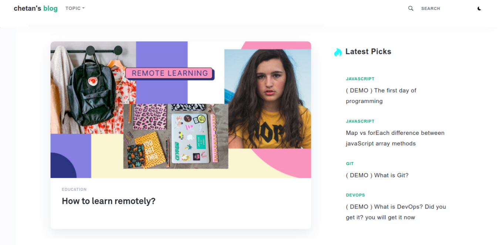

<p align="center">
  <a href="https://github.com/Ckbhatia/Ck-gatsby-blog">
    
  </a>
</p>
<h1 align="center">
  Ck Gatsby blog starter
</h1>

<h3 align="center">A beautiful and featureful gatsby blog starter for bloggers!</h3>
&nbsp;

<div align="center">

[](https://travis-ci.org/athityakumar/colorls)
[](https://github.com/Ckbhatia/Ck-gatsby-blog/pulls)
[](license.txt)
[](https://chetanblog.netlify.com)

</div>



&nbsp;

## Table of contents
+ [Features](http://github.com/ckbhatia/Ck-gatsby-blog#features)
+ [Quick Start](http://github.com/ckbhatia/Ck-gatsby-blog#quick-start)
+ [Set-up contentful CMS](http://github.com/ckbhatia/Ck-gatsby-blog#set-up)
+ [Deploy with Netlify](http://github.com/ckbhatia/Ck-gatsby-blog#deploy-with-netlify)
+ [Contributing](#contributing)
+ [Folder Structure](http://github.com/ckbhatia/Ck-gatsby-blog#folder-structure)
+ [License](http://github.com/ckbhatia/Ck-gatsby-blog#license)

## Features
+ Beautiful layout
+ Dark Mode
+ Beautiful typography
+ Code highlighting
+ Filter by topics ( upcoming )
+ Search articles ( upcoming )
+ Pagination support ( upcoming )
+ Mobile-Support
+ [Contentful CMS](http://contentful.com) support

**Request** to users, contributors and visitors. Please :star: star the repo to increase its reach.
It will help us to reach more users and contributors. So, they can support this beautiful project.


## Quick Start

#### Create a Gatsby site

Use the Gatsby CLI to create a new site, specifying the Ck gatsby starter.

```sh
# Create a new Gatsby blog site using the Ck blog gatsby starter
gatsby new <project-name> https://github.com/Ckbhatia/Ck-gatsby-blog
```

#### Start Developing

Navigate into your new site’s directory and start it up.

```sh
cd blog
gatsby develop
```

#### Open the source code and start editing!

Your site is now running at `http://localhost:8000`!

Note: You'll also see a second link: `http://localhost:8000/___graphql`. This is a tool you can use to experiment with querying your data. Learn more about using this tool in the [Gatsby tutorial](https://www.gatsbyjs.org/tutorial/part-five/#introducing-graphiql).

#### Access Locally
```
$ git clone https://github.com/[GITHUB_USERNAME]/[REPO_NAME].git
$ cd [REPO_NAME]
$ yarn
$ npm run develop
```

## Set-up contentful CMS

It's optional to set-up contentful CMS.

You can use any other CMS or create MDX files in this app.

Note: You need to modify config for other CMS or MDX else set-up contentful CMS to use this project.

- Create an account on contentful.com
- Navigate to the content model; click on add content type.
- Name it anything, for ex: blog.
- Click on Add field, create fields one by one.

There are seven types of fields required.

| Name | Field ID | Appearance | Other |
|---|---|:-:|---|
| Title  | title | Short Text | Entry File |
| Slug | slug | Short |
| Thumbnail | thumbnail | Media |
| Topic | topic | Short Text |
| Author | author | Short Text |
| Published | published | Date & Time  |
| Body | body | Rich Text |

Note: Field ID is case sensitive.

You can also use this pre-built [content model](https://gist.github.com/Ckbhatia/c8f85f2b9c0a842f344c9f48a08bb836)

### Config contentful

- Go to settings of contentful.com and click on API Key.
- Click on "Example Key 1", you can rename this.
- Copy Space ID and Content Delivery API - access token.
- Now, Navigate to your local copy of this repo.
- Create .env.development and .env.production file.
- Put these variables inside and save the file.
```
CONTENTFUL_SPACE_ID=<Paste here your space Id>
CONTENTFUL_ACCESS_TOKEN=<Paste here your delivery API - access token>
```

For Demo app:
```
CONTENTFUL_SPACE_ID=zorf8a5obm1d
CONTENTFUL_ACCESS_TOKEN=v4WRlGF6fTfBUrP54Hbaiava6VjPgKbW8mFEOgzEiPY
```

Note: contributors can use these credentials and skip to set-up their own contentful CMS.

### Publishing article with contentful
- Navigate to content on contentful.com
- Click on Add Blog Post button to create a post.
- Write your article and fill all the required fields.
- Publish your blog and deploy or re-deploy your own copy of this repo.


## Deploy with Netlify

Click the button below to build and deploy your own copy of the repository:

<a href="https://app.netlify.com/start/deploy?repository=http://github.com/ckbhatia/Ck-gatsby-blog" target="_blank"></a>

# Contributing

Your contributions are always welcome! Please have a look at the [contribution guidelines](CONTRIBUTING.md) first. :tada:

## Folder Structure

```
└── Public
└── static
    └── favicon
└── src
    ├── assets
    │   ├── _base
    │   ├── _general
    │   ├── _reset
    │   ├── _vars
    │   └── main
    ├── components
    │   ├── Article_page
    |   |   ├── MainBlog
    |   |   ├── Post
    |   |   ├── Share
    |   |   └── Sidebar
    |   ├── Main_page
    |   |   ├── Article
    |   |   ├── LatestPost
    |   |   ├── MainPage
    |   |   └── Sidebar
    │   ├── Footer
    │   ├── Head
    │   ├── Header
    │   ├── Layout
    │   ├── Loader
    │   ├── Mode
    │   └── Subscribe
    ├── Pages
    │   ├── 404
    │   └── Index
    ├── Posts
    ├── templates
    │   └── blog
    └── Context

```

## License
The MIT License (MIT)

Copyright (c) 2020 Chetan Kumar
